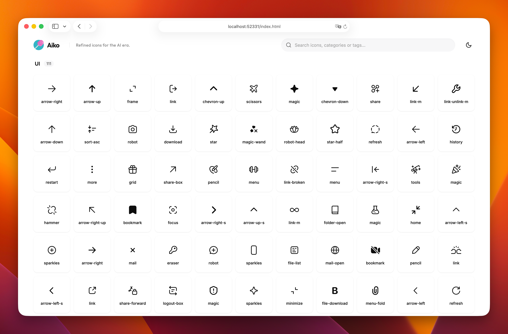

  <h1>Aiko</h1>
  
<em>Refined icons for the AI era.</em>

    
    
    

    

## Features

- **AI-Focused**: Meticulously designed for metaphors and actions prevalent in **AI agents and modern interfaces**
- **Pixel Perfection**: Every icon is hand-refined on a tight grid to ensure **absolute clarity** at any size
- **Lightweight**: Pure SVG-based architecture with **minimal code overhead** for fast performance
- **Theme Ready**: Optimized for both high-contrast light themes and **sophisticated dark modes**
- **Universal**: Easy to integrate via SVG sprites, direct paths, or **copy-paste usage**

## Usage

Browse and download icons online at [icon.miaoyan.app](https://icon.miaoyan.app). From there, you can:

- Search for icons by name or category.
- Customize colors on the fly.
- Copy SVG code or Download individual SVG/PNG files.

## Design Principles

Aiko belongs to the family of products including [MiaoYan](https://github.com/tw93/MiaoYan), [Pake](https://github.com/tw93/Pake), and [Mole](https://github.com/tw93/Mole). It shares the same DNA of:

1. **Minimalism**: Removing noise, keeping only the essence.
2. **Smoothness**: Using soft corners and consistent stroke weights.
3. **Clarity**: Ensuring the metaphor is instantly recognizable.

## Acknowledgements

Inspired by OpenAI's original icon assets.

## Support

1. I have two cats, TangYuan and Coke. If you think Aiko delights your life, you can feed them [food](https://miaoyan.app/cats.html?name=Aiko).
2. If you like Aiko, you can star it on GitHub. Also, welcome to follow my [Twitter](https://twitter.com/HiTw93) to get the latest news.

## License

MIT License - feel free to enjoy and participate in open source.
